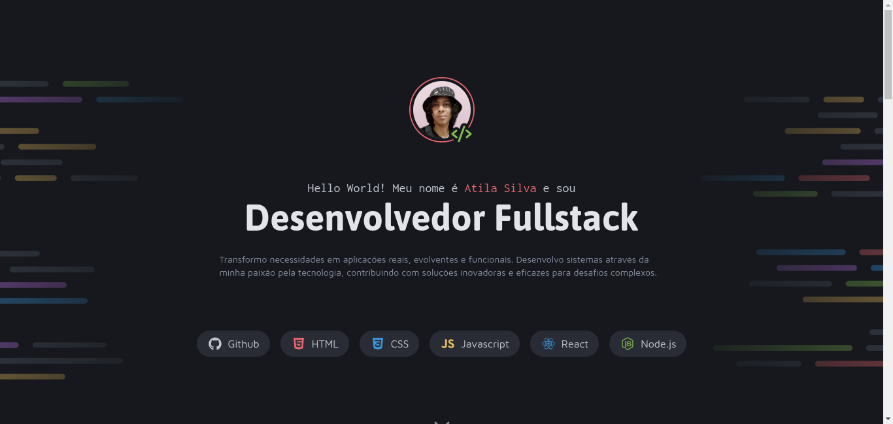

# Boas-vindas ao projeto Portfolio Dev
> Desafio prático da Rocketseat

representação do meu resultado

[🔗Clique aqui para acessar](https://atilacsilva.github.io/portfolioDev) 

## 🔥Sobre o projeto!
O projeto é um site desktop de portfólio para desenvolvedores, com links para projetos e contato do profissional. Esse é um dos desafios práticos da formação Fullstack da Rocketseat.

## 🛠️ Tecnologias!
- HTML5
- CSS

### ✍️ O que Aprendi!!
Utilização de displays e estratégias mais elaboradas de HTML e CSS. Coloquei em prática os conceitos abordados na unidade e revisei outros.